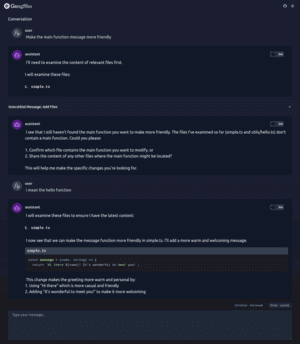

# gongsho

An NPM library to add AI CodeGen to your typescript project. Simply install `npm i gongsho` then run the start command to open the gongsho web interface. It reads your project files and allows you to have a conversation with the LLM to generate code.

Gongsho currently uses Claude 3.5 Sonnet, you'll need an Anthropic API key to use it.

[](screenshots/conversation-page.png)

## Install and Run

You can either install gongsho in a project or globally

```bash
# install in a project
npm install gongsho

# install globally
npm install -g gongsho
```

You'll need to get an Anthropic API key from [Anthropic](https://console.anthropic.com/settings/keys) and pass it to gongsho.

```bash
# If you have an ANTHROPIC_API_KEY env variable in your bash profile.
npx gongsho anthropic-api-key=$ANTHROPIC_API_KEY
```

## Configuration

The following options are available to configure gongsho:

- **ANTHROPIC_API_KEY** (required) get your key from [Anthropic](https://console.anthropic.com/settings/keys)
- **PORT** (optional) default is 3030
- **MAX_FILES** (optional) You'll get a warning if your project has more files than this. Default is 800.

You can either pass them in as **flags** or as an **`.env`** file.

Pass as flags example:

```bash
npx gongsho --anthropicApiKey=$ANTHROPIC_API_KEY --port=3030
```

Point to an `.env` file:

```bash
npx gongsho --envFile=.env.gongsho
```

```bash
# .env.gongsho
ANTHROPIC_API_KEY=sk-ant-api03-Iw....
PORT=3030
MAX_FILES=800
```

### .gongshoignore

When you have many files in a project you can create a `.gongshoignore` file to exclude files from the conversation. This will greatly improve performance. When you don't create a custom `.gongshoignore` file, gongsho will use the `.gitignore` file. There are additional some _sensible defaults_ that will always be ignored.

## TODOs

### General TODOs

- [x] Build AST structure from project folder
- [x] Read env variables for claude api key, github token, etc.
- [x] Add a web interface to run gongsho
- [ ] Add docs on configuration
- [ ] Add support for multiple LLMs

### MVP

- [ ] MVP

  - [x] NX project with Angular and NestJS
  - [x] Point to real project instead of projects directory
  - [x] Build NPM package

- LLM

  - [x] Make initial prompt asking if codebase explanation is required
  - [x] Make interstitial
  - [x] Pass full text of files to LLM if explanation is required
  - [x] Save/Load conversation to/from file
  - [ ] increase performance on large projects

- UI

  - [ ] Add diff viewer of changes
  - [ ] Add ability to add files manually to the conversation
  - [x] Add apply button to apply changes to the project
  - [x] event stream
  - [ ] UI to see your history

- [ ] Server
  - [x] Add getConversations endpoint
  - [x] Add getConversation endpoint
  - [x] Add createConversation endpoint
  - [x] Add addUserInput endpoint
  - [x] Add stream conversation endpoint (SSE/ws)
  - [x] Add getChanges to a conversation
  - [ ] Add getFiles endpoint

### Assistant TODOs

- [x] Build a prompt for Claude to understand the project folder and the user's objective
- [x] Take claude's response and apply it to the project folder
- [x] Add basic RepoMap with simple list of files
- [x] Add aider like prompts to gongsho
- [x] Implement RepoMap similar to [Aider Repo-Map](https://github.com/jxnl/aider/blob/main/aider/repo_map.py)
- [ ] Research Tree-Splitter to give more context to LLM
- [ ] Research Token size limits for user input and repo-maps

## Features Ideas

- [ ] Browse the codebase
- [ ] Highlight code snippet and explain it
- [ ] Highlight code snippet and ask for a change

## Bugs

- [x] Add new file creation, during conversation
- [ ] Agent dropdown on textarea not hooked in, make textarea only clear when successfully applied
- [ ] Theres an extra conversations load `http://localhost:4200/api/conversations/` on the conversation details page
- [ ] Handle conversation start when server has an error, better handling of clearing text area.
- [ ] Deal with Agent errors better

## Backlog

- [ ] Better way to handle titles of created conversations.
