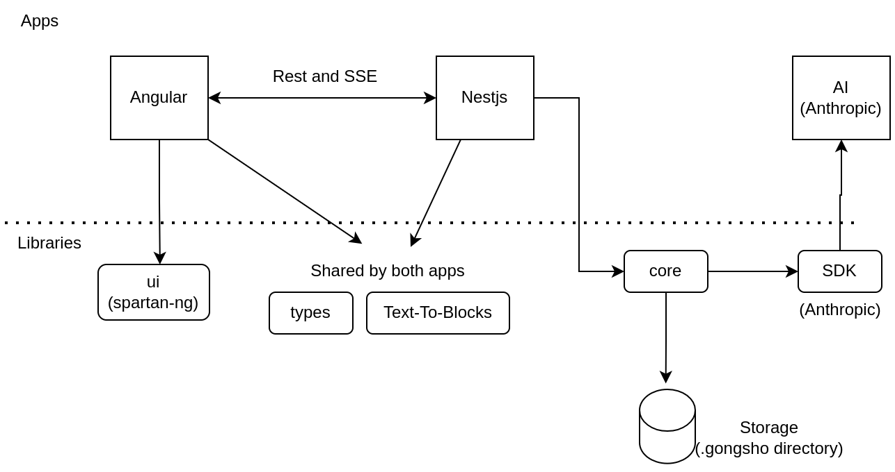

# Developing Gongsho

- [Configuration](#configuration)
- [Running](#running-the-ui-and-api)
- [Git Commit Guidelines](#git-commit-guidelines-for-squashed-commits)
- [Command Line Tools](#command-line-tools)

## Configuration

Copy the `.env.example` file.

```shell
cp .env.example .env
```

Add an anthropic api key to the `.env` file.

## Running The UI and API

```shell
npm run start:ui
# run the server pointing to the `test-project` folder
npm run dev:api


# or point gongsho at gongsho :-)
npm run start:api
```

## Major systems



Apps:

- **apps/ui** - This is the UI for the application
- **apps/api** - This is the API for the application.

Libraries:

These shared libraries are used by both the UI and API.

- **libs/types** - Shared types for front end/ backend
- **libs/text-to-blocks**
- **libs/core**
- **libs/ui** - see [spartan.ng](https://spartan.ng/) for component information.

## Git Commit Guidelines for squashed commits

**NOTE** If you are a contributed developer. You may submit your PRs with multple commits and you do not need to follow this conventions.
**This convention is a guideline for merging to main**

Gongsho follows [conventional commits](conventional-commits). This standard is used to generate the [CHANGELOG](CHANGELOG).

### Commit Message Format

Each commit message consists of a **header**, a **body** and a **footer**. The header has a special format that includes a **type**, a **scope** and a **subject**:

```
<type>(<scope>): <subject>
<BLANK LINE>
<body>
<BLANK LINE>
<footer>
```

### Type

Must be one of the following:

- **feat**: A new feature
- **fix**: A bug fix
- **docs**: Documentation only changes
- **style**: Changes that do not affect the meaning of the code (white-space, formatting, missing
  semi-colons, etc)
- **refactor**: A code change that neither fixes a bug nor adds a feature
- **perf**: A code change that improves performance
- **test**: Adding missing or correcting existing tests
- **chore**: Changes to the build process or auxiliary tools and libraries such as documentation
  generation

### Scope

The scope could be anything specifying place of the commit change. For example `options`,
`search`, `index`, etc...

You can use `*` when the change affects more than a single scope.

### Subject

The subject contains succinct description of the change:

- use the imperative, present tense: "change" not "changed" nor "changes"
- don't capitalize first letter
- no dot (.) at the end

### Body

Just as in the **subject**, use the imperative, present tense: "change" not "changed" nor "changes". The body should include the motivation for the change and contrast this with previous behavior.

### Footer

The footer should contain any information about **Breaking Changes** and is also the place to [reference GitHub issues that this commit closes][closing-issues].

**Breaking Changes** should start with the word `BREAKING CHANGE:` with a space or two newlines. The rest of the commit message is then used for this.

## Command Line Tools

### Project Dependencies

```shell
npx nx dep-graph
npx nx show project ui
```

### Generate New Library

```shell
npx nx g @nx/node:library libs/text-to-blocks --dry-run
```

### NestJS Generators

```shell
npx nx g @nx/nest:controller apps/api/src/app/foo.controller.ts
npx nx g @nx/nest:service apps/api/src/app/conversations.service.ts
```

### Angular Generators

```shell
npx nx g @nx/angular:component apps/ui/src/app/spartan-component.ts
```

### Tailwind Setup

```shell
npx nx g @nx/angular:setup-tailwind
```

### Spartan Angular Commands

```shell
npx nx g @spartan-ng/cli:healthcheck
npx nx g @spartan-ng/cli:ui-theme
npx nx g @spartan-ng/cli:ui
```

### Linting

```shell
npx eslint --debug apps/ui/eslint.config.mjs
npx @eslint/migrate-config apps/ui/eslint.config.mjs
```

### Testing

```shell
npx jest --config libs/text-to-blocks/jest.config.ts libs/text-to-blocks
```

### Package Management

```shell
npx nx migrate latest --interactive
npx nx migrate --run-migrations --if-exists
```

[closing-issues]: https://help.github.com/articles/closing-issues-via-commit-messages/
[conventional-commits]: https://www.conventionalcommits.org/en/v1.0.0-beta.2/
[changelog]: CHANGELOG.md

### Manually update dependencies in package.json's

```shell
./tools/sync-updates.sh ai @ai-sdk/anthropic
```
